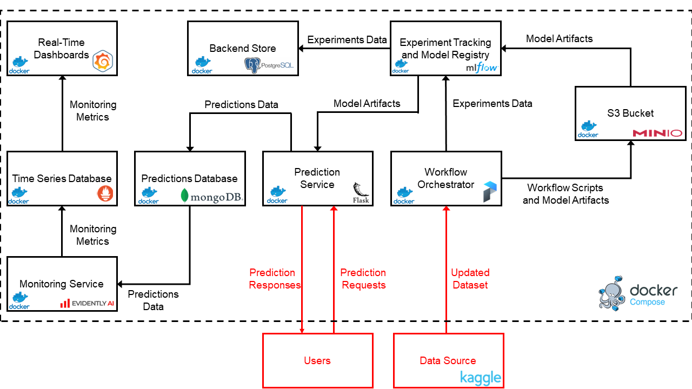

# Maternal Health Risk Predictor

## Objective

This repository contains the final project for the [MLOps Zoomcamp](https://github.com/DataTalksClub/mlops-zoomcamp) course provided by [DataTalks.Club](https://datatalks.club/).


## Context

According to the World Health Organization (WHO):

"*Maternal health refers to the health of women during pregnancy, childbirth and the post-natal period. Each stage should be a positive experience, ensuring women and their babies reach their full potential for health and well-being. Although important progress has been made in the last two decades, about 295 000 women died during and following pregnancy and childbirth in 2017. This number is unacceptably high. The most common direct causes of maternal injury and death are excessive blood loss, infection, high blood pressure, unsafe abortion, and obstructed labour, as well as indirect causes such as anemia, malaria, and heart disease. Most maternal deaths are preventable with timely management by a skilled health professional working in a supportive environment. Ending preventable maternal death must remain at the top of the global agenda. At the same time, simply surviving pregnancy and childbirth can never be the marker of successful maternal health care. It is critical to expand efforts reducing maternal injury and disability to promote health and well-being. Every pregnancy and birth is unique. Addressing inequalities that affect health outcomes, especially sexual and reproductive health and rights and gender, is fundamental to ensuring all women have access to respectful and high-quality maternity care.*"

The goal of the project is to apply what has been learned during the MLOps Zoomcamp course to build a MLOps pipeline for woman health risk prediction during pregnancy. 


## Dataset

The dataset used to feed the MLOps pipeline has been downloaded from [Kaggle](https://www.kaggle.com/datasets/pyuxbhatt/maternal-health-risk) and contains data collected from several hospitals, community clinics and maternal health cares through an IoT-based risk monitoring system. The dataset is updated daily and is characterized by the following features:

| Feature | Description |
| --- | --- |
| Age | Age when a woman is pregnant. |
| SystolicBP | Upper value of blood pressure. |
| DiastolicBP | Lower value of blood pressure. |
| BS | Blood glucose levels in terms of molar concentration. |
| HeartRate | A normal resting heart rate. |
| BodyTemp | Average human body temperature. |
| Risk Level | Predicted risk intensity level during pregnancy considering the previous attributes. |


## MLOps pipeline

### Architecture




### Deployment

The MLOps pipeline is fully dockerised and can be easily deployed via the following steps:

1. Clone the `maternal-health-risk` repository locally:

    ```bash
    $ git clone https://github.com/Peco602/maternal-health-risk.git
    ```

2. Install the pre-requisites necessary to run the pipeline:

    ```bash
    $ cd maternal-health-risk
    $ sudo apt install make
    $ make prerequisites
    ```

    It is also suggested to add the current user to the `docker` group to avoid running the next steps as `sudo`:

    ```bash
    $ sudo groupadd docker
    $ sudo usermod -aG docker $USER
    ```

    then, logout and log back in so that the group membership is re-evaluated.

3. [*Optional*] Configure the development evironment:

    ```bash
    $ make setup
    ```

    This is required to perform further development and testing on the pipeline.

4. [*Optional*] Insert Kaggle credentials in the `.env` file to allow the automatic scheduled dataset update:

    ```bash
    # Kaggle credentials
    KAGGLE_USERNAME=*****
    KAGGLE_KEY=*****
    ```

    In case the credentials are not available, the training dataset `data/data.csv` must be updated manually.

5. Pull the Docker images:

    ```
    $ make pull
    ```

6. Launch the MLOps pipeline:

    ```
    $ make run
    ```

    Once ready, the following services will be available:

    | Service | Port | Interface | Description |
    | --- | --- | --- | --- |
    | Web Application | 80 | 0.0.0.0 | Prediction web service (see picture below) |
    | Prefect | 4200 | 127.0.0.1 | Training workflow orchestration |
    | MLFlow | 5000 | 127.0.0.1 | Experiment tracking and model registry |
    | MinIO | 9001 | 127.0.0.1 | S3-equivalent bucket management |
    | Evidently | 8085 | 127.0.0.1 | Data and target drift report generation (`/dashboard` route) |
    | Grafana | 3000 | 127.0.0.1 | Data and target drift real-time dashboards |


    


### Training

Once the MLOps pipeline has been started, the prediction web service can already work thanks to a default pre-trained model available in the Docker image. In order to enable pipeline training workflow it is necessary to create a scheduled Prefect deployment via:

```
$ make deployment
```

The training workflow will be then automatically executed every day. It will download the latest dataset (if the Kaggle credentials have been provided), search the best model in terms of accuracy among XGBoost, Support Vector Machine and Random Forest and finally will store it in the model registry. It is worth noting the training workflow can also be immediately executed without waiting the next schedule:

```
$ make train
```

Once the updated model is ready, it can be moved to production by restarting the pipeline:

```
$ make restart
```

the web service will automatically connect to the registry and get the most updated model. If the model is still not available, it will continue to use the default one.


### Monitoring

It is possible to generate simulated traffic via:

```
$ make generate-traffic
```

Then, the prediction service can be monitored via:

- Grafana (in real-time): `http://127.0.0.1:3000`
- Evidently (for report generation): `http://127.0.0.1:8085/dashboard`


### Disposal

The MLOps pipeline can be disposed via:

```
$ make kill
```

while the Docker volumes used for persistence can be removed via:

```
$ make clean
```


## GitHub Actions

- **Continuous Integration**: On every push and pull request on `main` and `dev` branches, the Docker images are built, tested and then pushed to DockerHub.
- **Continuous Deployment**: On every push and pull request on `main` branch, only if the Continuous Integration workflow has been successful successful, the updated pipeline is deployed to the target server and run.


## Applied technologies

| Name | Scope |
| --- | --- |
| Jupyter Notebooks | Exploratory data analysis and pipeline prototyping. |
| Docker | Application containerization. |
| Docker-Compose | Multi-container Docker applications definition and running. |
| Prefect | Workflow orchestration. |
| MLFlow | Experiment tracking and model registry. |
| PostgreSQL | MLFLow experiment tracking database. |
| MinIO | High Performance Object Storage compatible with Amazon S3 cloud storage service. |
| Flask | Web server. |
| Bootstrap | Frontend toolkit. |
| MongoDB | Prediction database. |
| EvidentlyAI | ML models evaluation and monitoring. |
| Prometheus | Time Series Database for ML models real-time monitoring. |
| Grafana | ML models real-time monitoring dashboards. |
| pytest | Python unit testing suite. |
| pylint | Python static code analysis. |
| black | Python code formatting. |
| isort | Python import sorting. |
| Pre-Commit Hooks | Simple code issue identification before submission. |
| GitHub Actions | CI/CD pipelines. |


## Disclaimer

This prediction service has been developed as the final project of the MLOps Zoomcamp course from DataTalks.Club. It does not provide medical advice and it is intended for informational purposes only. It cannot be considered a substitute for professional medical advice, diagnosis or treatment. Never ignore professional medical advice in seeking treatment because of something you have read here.
